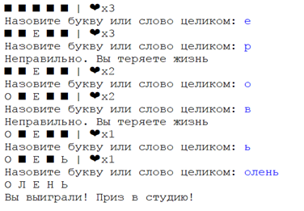

## Задачи на случайные последовательности

__Задача 1.__ Напишите программу, которая с помощью модуля random генерирует случайный пароль. Программа принимает на вход длину пароля и выводит случайный пароль, содержащий только символы английского алфавита a..z, A..Z (в нижнем и верхнем регистре).

__Задача 2.__ Дополнить задачу. В каждом пароле обязательно должна присутствовать хотя бы одна цифра и как минимум по одной букве в верхнем и нижнем регистре.

__Задача 3.__ IP адрес состоит из четырех чисел из диапазона от 0 до 255 (включительно), разделенных точкой.
Напишите программу, которая с помощью модуля random генерирует и возвращает случайный корректный IP адрес.

__Задача 4.__ Поле-чудес
У вас есть список слов: “книга”, “месяц”, “ручка”, “шарик”, “олень”, “носок”.
Необходимо выбрать случайным образом слово и отрисовать его, используя
вместо букв какие-либо символы, например '\u25A0' (■), ‘\u2660' (♠) или '\u2665' (♥)
Необходимо установить счётчик “жизни” в какое-либо значение, например

•	Предложить игроку ввести букву или всё слово целиком.
•	Если буква правильная, то слово перерисовывается с видимой буквой.
•	Если буква неправильная, то у игрока отнимается одна “жизнь”.
•	Если игрок ввёл слово и это слово правильно, либо это последняя правильная буква, либо у игрока закончились “жизни”, то игра заканчивается.

Примерный вид программы



### Задания на кортежи


__Задача 1.__ Имеется кортеж:
```python
t = (3.4, -56.7)
```
Вводится последовательность целых чисел в одну строчку через пробел. Необходимо их добавить в кортеж t (генератором или функцией map). Результат вывести на экран

### Входные данные:
```
8 11 -5 2
```
### Выходные данные:
```
(3.4, -56.7, 8, 11, -5, 2)
```

__Задача 2.__ Вводятся названия городов в одну строку через пробел. На их основе формируется кортеж.

Если в этом кортеже нет города "Москва", то следует его добавить в конец кортежа. Результат вывести на экран в виде строки с названиями городов через пробел.

Применить тернарный оператор.

### Входные данные:
```
Уфа Казань Самара
```
### Выходные данные:
```
Уфа Казань Самара Москва
```

__Задача 4.__ Вводятся имена студентов в одну строчку через пробел. На их основе формируется кортеж.

Отобразите на экране все имена из этого кортежа, которые содержат фрагмент "ва" (без учета регистра).

Имена выводятся в одну строчку через пробел в нижнем регистре (малыми буквами).

### Входные данные:
```
Петя Варвара Венера Василиса Василий Федор
```
### Выходные данные:
```
варвара василиса василий
```


__Задача 5.__ Вводится натуральное число n. Необходимо сформировать с помощью генератора кортеж, состоящий из делителей числа n (включая и само число n).

Результат вывести на экран в одну строку через пробел.
### Входные данные:
```
10
```
### Выходные данные:
```
1 2 5 10
```


__Задача 5. Вводится натуральное число N. Необходимо сгенерировать вложенный кортеж с помощью генератора, размером N x N, где первая строка содержала бы все нули, вторая - все единицы, третья - все двойки и так до N-й строки. Результат вывести в виде таблицы чисел как показано в примере ниже.
### Входные данные:
```
4
```
### Выходные данные:
```0 0 0 0
1 1 1 1
2 2 2 2
3 3 3 3
```

__Задача 6.__ Имеется двумерный кортеж, размером 5 x 5 элементов:

```t = ((1, 0, 0, 0, 0),
     (0, 1, 0, 0, 0),
     (0, 0, 1, 0, 0),
     (0, 0, 0, 1, 0),
     (0, 0, 0, 0, 1))
```
Вводится натуральное число N (N < 5). Необходимо на основе кортежа t сформировать новый аналогичный кортеж t2 размером N x N элементов. Результат вывести на экран в виде таблицы чисел.
### Входные данные:
3
### Выходные данные:
1 0 0
0 1 0
0 0 1
```
t = ((1, 0, 0, 0, 0),
     (0, 1, 0, 0, 0),
     (0, 0, 1, 0, 0),
     (0, 0, 0, 1, 0),
     (0, 0, 0, 0, 1))
```

__Задача 7.__ Вводятся пункты меню (каждый пункт с новой строки) в формате:
```
название_1 URL-адрес_1
название_2 URL-адрес_2
...
```
Необходимо эту информацию представить в виде вложенного кортежа menu в формате:
```
((название_1, URL-адрес_1), (название_2, URL-адрес_2), ... (название_N, URL-адрес_N))
```
Результат вывести на экран в виде кортежа

### Входные данные:
```
Главная home
Python learn-python
Java learn-java
PHP learn-php
```
### Выходные данные:
```
(('Главная', 'home'), ('Python', 'learn-python'), ('Java', 'learn-java'), ('PHP', 'learn-php'))
```

Задания на словари

__Задача 1.____ Вводятся данные в формате ключ=значение в одну строчку через пробел. Значениями здесь являются целые числа (см. пример ниже). Необходимо на их основе создать словарь d с помощью функции dict() и вывести его на экран командой:
```python
print(*(d.items()))
```
### Входные данные:
```
one=1 two=2 three=3
```
### Выходные данные:
```
('one', 1) ('three', 3) ('two', 2)
```

__Задача 2.__ Строка содержит только заглавные буквы латинского алфавита (ABC…Z). Определите символ, который чаще всего встречается в файле между двумя одинаковыми символами.
Например, в тексте CBCABABACCC есть комбинации CBC, ABA (два раза), BAB и CCC. Чаще всего  — 3 раза  — между двумя одинаковыми символами стоит B, в ответе для этого случая надо написать B - 3.

### Входные данные:
```
FPFHQDFWBPLLIJZPNKJEFWVHWNOKPRHUYVDALCXTQXHLSKTJGENYIDHSCPRBNUBMPICEHRRIQDSWDCWJFNQEPRFLDJFXSBUBECRZXHSPNPCQSACBBGMZBONQCKFFDAZBKJBTVCHMORBSFTQBHGDNDWXTEUQAHZDZXTOXHGIUKXMWBOQKTCYNCVPUWISKCNLENHFLQAIQAGNQUOVIFOBMNJOHFTRITCBZTWGVXSXOJUBZMABSGBUVXBKKPBZPVQHLBLTJVDMIVKWUNDWGNZXOOOWUFTSNNENKFTFQDTJACANYWCZQDUMBDNYZGCZUIQRIVXINGWJBQTXYQHWALCXISXPDJOXYLSQBOFWUETLQJUQHKFGNZMFIRRDHQTXYENGUVZEKWMDXAWPRNCPEUORSTADPRDTPQYFTBUHXWJYNESUMMNQFXIYXBCZEPZJXHGQBINTXHDL
```

### Выходные данные:
```
N - 2
```


__Задача 3.__ Вводятся номера телефонов в одну строчку через пробел с разными кодами стран: +7, +6, +2, +4 и т.д. Необходимо составить словарь d, где ключи - это коды +7, +6, +2 и т.п., а значения - список номеров (следующих в том же порядке, что и во входной строке) с соответствующими кодами. Полученный словарь вывести командой:
```python
print(*sorted(d.items()))
```
### Входные данные:
```
+71234567890 +71234567854 +61234576890 +52134567890 +21235777890 +21234567110 +71232267890
```
### Выходные данные:
```
('+2', ['+21235777890', '+21234567110']) ('+5', ['+52134567890']) ('+6', ['+61234576890']) ('+7', ['+71234567890', '+71234567854', '+71232267890'])
```

Задания на множества

__Задача 1.__ Вводится текст в одну строку, слова разделены пробелом. Необходимо подсчитать число уникальных слов (без учета регистра) в этом тексте. Результат (число уникальных слов) вывести на экран.
### Входные данные:
```
Мама мыла раму а потом мыла кота и еще мыла пол
```
### Выходные данные:
9

__Задача 2.__ Вводятся два списка целых чисел каждый с новой строки (в строке наборы чисел через пробел). Необходимо выбрать и отобразить на экране уникальные числа, присутствующие и в первом и во втором списках одновременно. Результат выведите на экран в виде строки чисел, записанных по возрастанию через пробел, используя команду (здесь s - это множество):
print(*sorted(s))
### Входные данные:
```
8 11 12 15 -2
4 11 10 15 -5 1 -2
```
### Выходные данные:
```
-2 11 15
```

__Задача 3.__ Вводятся два списка целых чисел каждый с новой строки (в строке наборы чисел через пробел). Необходимо выбрать и отобразить на экране уникальные числа, присутствующие в первом списке, но отсутствующие во втором. Результат выведите на экран в виде строки чисел, записанных по возрастанию через пробел.
### Входные данные:
```
8 5 3 5 -3 1
1 2 3 4
```
### Выходные данные:
```
-3 5 8
```


__Задача 4.__ На вход программе подается строка, состоящая из цифр. Необходимо определить, верно ли, что в ее записи ни одна из цифр не повторяется?

__Задача 5.__ На вход программе подаются две строки, состоящие из цифр. Необходимо определить, верно ли, что в записи этих двух строк используются все десять цифр?

__Задача 6.__ Анаграммы. Пользователь вводит два слова (два раза вызываем ```input()```), а программа пишет, являются ли они анаграммой. Анаграммой называют пару слов, которые состоят из одного и того же набора букв. Причём количество каждой буквы тоже должно совпадать в обоих словах.

Примеры анаграмм:
- апорт-тропа
- дежурство - дружество
- антиквар - травинка
- просветитель - терпеливость
- равновесие - своенравие
- автопарк - отправка
- минотавр - норматив
- отсечка - сеточка - стоечка - тесачок - чесотка
- останки - остинка - скотина

__Задача 7.__ Необходимо написать программу для проверки пароля на безопасность, в данном случае необходимо соблюсти хотя бы три критерия:

* Длина пароля не менее 5 символов

* Содержит буквы латинского алфавита как в верхнем, так и в нижнем регистре

* Хотя бы одну цифру от 0 до 9
* Хотя бы один спец.символ: "@,#,%,&

__Задача 8.__  Отзывы на чат-бот

Дано множество сообщений пользователей с их оценкой работы чат-бота. Все они содержат эмодзи. Также даны два множества эмодзи, отражающие положительные и отрицательные эмоции. Каждый эмодзи - это просто текстовая строка из одного специального символа.

```python
happy_emojis = {'💯', '😍', '👌', '😇', '🫶', '👍', '🙏', '👏', '☺', '🙂', '🥰', '❤', '😊', '😉'}
unhappy_emojis = {'👎', '🤨', '😒', '💩', '🖕', '😖', '☹', '😠', '😡', '😑', '😐', '🙄', '😔', '🙁'}

texts = {
  '👏👏👏 Впечатлен оперативностью и точностью ответов бота.',
  'Очень рад, что чат-бот доступен круглосуточно 🙏',
  'Бот вообще не помог мне разобраться в проблеме ☹',
  'Бот не понимает контекста вопроса, это раздражает 😠',
  'Бот помог мне быстро разобраться в сложной ситуации 👍',
  'Бот решил мою проблему быстро и уверенно 👌',
  'Бот хорошо понимает мои запросы, это удивительно! 😍',
  'Вопросы напрочь игнорируются, это не устраивает 😡',
  'Впечатляющий сервис, спасибо за помощь! 🙏',
  'Невозможно получить развернутый и полезный ответ от бота 👎👎👎',
  'Отлично справляется с техническими вопросами, молодец! 😇😇😇',
  'Очень недоволен отсутствием результата после общения с ботом 🙁',
  '👍Очень удобно общаться с чат-ботом техподдержки.',
  'Переписка с ботом только усугубила мою ситуацию 😖',
  'Плохая реакция на мои запросы, чувствую себя безнадежно 😔',
  'Помог решить проблему!👍 Но пришлось несколько раз переформулировать вопрос🙄',
  'Спасибо за быстрый отклик!❤ Это очень ценно!',
  'Бесполезный бот! 👎👎 Надеюсь, его разработчика уволят 😊',
  '👍 Очень полезный инструмент для решения технических проблем.',
  '👎 Попробовал обратиться за помощью, но бот оказался бесполезным.',
  '😔 Разочарован пассивностью и безполезностью бота.',
  '🙄 Бот отвечает стандартными фразами, не решая проблему.'
  }
```

а) Вывести на экран все сообщения, содержащие эмодзи из множества ```unhappy_emojis```.

<details><summary>Как узнать, есть ли символ в строке</summary>
У строк есть операция <tt>in</tt>, позволяющая узнать, есть ли в строке какой-то символ или последовательность символов. Результат такой операции - <tt>True</tt> или <tt>False</tt>.
<pre>
x = '❤' in 'Я ❤ Python'  # True
y = '💯' in '99'  # False
</pre>
</details>

<details><summary>Как свести задачу к операции над множествами?</summary>
Строку можно превратить в множество с помощью функции <tt>set()</tt>. Получим множество символов, содержащихся в этой строке.

Имея множество символов в строке и множество эмодзи, можно с помощью операции их пересечения посмотреть, есть ли строке эти эмодзи. Пересечение множеств записывается как <tt>z = x & y</tt>. Если полученное множество не пустое (его длина, измеренная с помощью <tt>len()</tt>, больше нуля), то искомые эмодзи там есть.</details>

б) Создать два множества - одно с сообщениями, имеющими положительные реакции, другое - с отрицательными реакциями.

<details><summary>Как создать и заполнить множества?</summary>
Пустое множество создаётся вызовом команды <tt>set()</tt> (а не пустыми фигурными скобками). Добавить элемент в множество - <tt>x.add(y)</tt>.

Также можно использовать генератор множества:
<pre>x = {y for y in z if blah_blah_blah}</pre>
</details>

в) Создать множество сообщений, в которых отсутствуют эмодзи с отрицательными эмоциями. Сравнить с множеством сообщений с положительными эмодзи. Сравнить эти два множества: равны ли они, или же одно является подмножеством другого.

г) Узнать, есть ли сообщения, содержащие оба вида эмодзи. Вывести их на экран, если таковые найдутся.

д) Вывести на экран сколько процентов сообщений содержат положительные эмодзи, а сколько - отрицательные.


### Задания на zip

__Задание 1__ Вводятся два списка целых чисел. Необходимо попарно перебрать их элементы и перемножить между собой. При реализации программы используйте функции zip и map. Выведите на экран первые три значения, используя функцию next. Значения выводятся в строчку через пробел. (Полагается, что три выходных значения всегда будут присутствовать).

### Входные данные:

```
-7 8 11 -1 3
1 2 3 4 5 6 7 8 9 10
```

### Выходные данные:
```
-7 16 33
```

__Задание 2__ Чек из супермаркета

Дан список покупок в виде словаря с вложенными списками:

```python
receipt = {
    'Наименование': ['HORTEX Фасоль стручк. б/зам', 'Яблоки КРИПС ПИНК отборные', 'ДОБ.НЕК.БОД.ЦИТ.ап/гр/ман/ли', 'СВЯТ.ИСТ.Вода прир.пит.негаз. ПЭТ 5л', 'СПк Свинина с грибами зап. 1к', 'МЯГК ВАФ С ВАР СГ ЯШ', 'КАРТОФЕЛЬ БЕЛЫЙ РАНН', 'ЧУДО Мол.ВАН.стер.фр.2% 200г', 'Пакет майка', 'GOUR.Корм MON PETIT.кош.кур.', 'Ф-Н.Пюре и/яб/абр со сл/сах', 'MATTI Мюсли ОРЕХ/ЯБЛОКО 250г', 'ХЛ.ДОМ Кекс Яг. Лук.нач.ч.см', 'GREENF.Чай GOLD.CEYL.чер.', 'Куриное Филе ПЕТЕЛ.на подл'],
    'Кол-во': [1, 0.466, 2, 1, 0.178, 2, 0.57, 5, 1, 10, 6, 1, 1, 1, 0.758],
    'Цена': [124.9, 129.9, 189.9, 104.9, 699.0, 37.6, 44.9, 44.9, 6.9, 23.9, 57.9, 129.9, 89.9, 119.9, 355.01],
    'Цена со скидкой': [124.9, 129.9, 109.9, 104.9, 699.0, 37.6, 44.9, 44.9, 6.9, 17.9, 34.9, 69.9, 59.9, 69.9, 279.89],
}
```

Каждый список в словаре соответствует колонке таблицы:

Наименование                         | Кол-во |  Цена  | Цена со скидкой
-------------------------------------|-------:|-------:|----------------:
HORTEX ФАСОЛЬ СТРУЧК. Б/ЗАМ          |      1 | 124.90 | 124.90
ЯБЛОКИ КРИПС ПИНК ОТБОРНЫЕ           |  0.466 | 129.90 | 129.90
ДОБ.НЕК.БОД.ЦИТ.АП/ГР/МАН/ЛИ         |      2 | 189.90 | 109.90
СВЯТ.ИСТ.ВОДА ПРИР.ПИТ.НЕГАЗ. ПЭТ 5Л |      1 | 104.90 | 104.90
СПК СВИНИНА С ГРИБАМИ ЗАП. 1К        |  0.178 | 699.00 | 699.00
МЯГК ВАФ С ВАР СГ ЯШ                 |      2 |  37.60 |  37.60
КАРТОФЕЛЬ БЕЛЫЙ РАНН                 |  0.570 |  44.90 |  44.90
ЧУДО МОЛ.ВАН.СТЕР.ФР.2% 200Г         |      5 |  44.90 |  44.90
ПАКЕТ МАЙКА                          |      1 |   6.90 |   6.90
GOUR.КОРМ MON PETIT.КОШ.КУР.         |     10 |  23.90 |  17.90
Ф-Н.ПЮРЕ И/ЯБ/АБР СО СЛ/САХ          |      6 |  57.90 |  34.90
MATTI МЮСЛИ ОРЕХ/ЯБЛОКО 250Г         |      1 | 129.90 |  69.90
ХЛ.ДОМ КЕКС ЯГ. ЛУК.НАЧ.Ч.СМ         |      1 |  89.90 |  59.90
GREENF.ЧАЙ GOLD.CEYL.ЧЕР.            |      1 | 119.90 |  69.90
КУРИНОЕ ФИЛЕ ПЕТЕЛ.НА ПОДЛ           |  0.758 | 355.01 | 279.89

а) Используя функцию ```zip()```, обойдите попарно списки с ценой со скидкой и количеством. Посчитайте суммарную стоимость корзины. Цена в колонке указана за одну единицу товара.

б) Посчитайте суммарную сумму скидки в рублях для всей корзины целиком.

★ в) Найдите товар с самой большой скидкой в *процентах*. Выведите на экран наименование товара размер его скидки в рублях и процентах.


